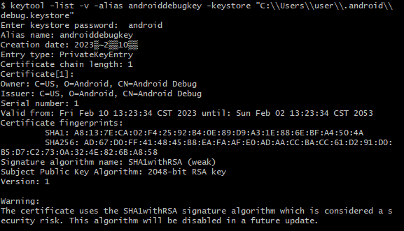
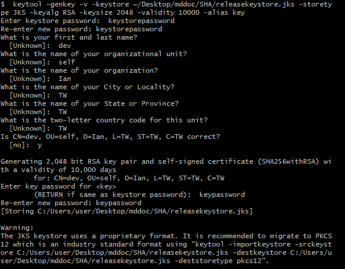
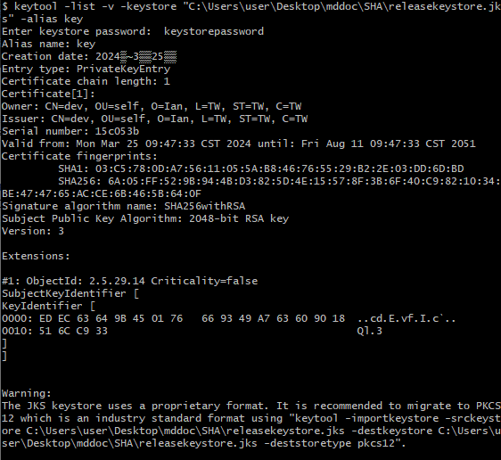

SHA金鑰
===

>#### Debug Keystore(偵錯金鑰)
>>##### 當你在開發和測試Flutter應用程式時，使用Debug模式運行時需要使用Debug Keystore。它是由Android SDK自動生成的憑證，用於簽署和驗證應用程式的APK文件。Debug Keystore主要用於開發和測試階段，不應該用於正式上架的應用程式。
>>+ ##### 用於本地開發、調試和模擬機運行應用程式。
>>+ ##### 使用 flutter run 或在模擬機上運行應用程式時，使用 Debug Keystore 來簽署 APK 文件。
>>+ ##### 這是由 Android SDK 自動生成的金鑰憑證，用於開發和測試期間，並且不應該在正式上架到 Google Play 商店時使用。

---
>#### Release Keystore(發行金鑰憑證)
>>##### 當你準備將Flutter應用程式上架到Google Play時，需要使用Release Keystore。Release Keystore是由你自己創建並保管的金鑰憑證，用於簽署正式上架的應用程式。它用於確保應用程式的安全性，並防止未經授權的人對你的應用程式進行修改或篡改。
>>+ ##### 用於正式版的構建和上架到 Google Play 商店。
>>+ ##### 使用 flutter build --release 或 flutter build appbundle 命令時，使用 Release Keystore 來簽署 APK 文件或 AAB 文件。
>>+ ##### Release Keystore 是由你自己創建並保管的金鑰憑證，用於識別和驗證你作為應用程式的開發者身份。

---
>#### Google Play Console應用程式簽署金鑰憑證
>>##### 當你在Google Play Console上創建應用程式時，你需要上傳Release Keystore（發行金鑰憑證）的相關信息，以確保你是應用程式的合法發布者。Google Play Console將使用此金鑰憑證對上傳的APK文件進行簽署，以確保應用程式的完整性和來源的真實性。
>>+ ##### 在上架到 Google Play 商店時，你需要在 Google Play Console 中上傳 Release Keystore 的相關信息。
>>+ ##### Google Play Console 使用這個應用程式簽署金鑰憑證來簽署你的應用程式的 APK 文件，確保應用程式的完整性和來源的真實性。
>>+ ##### 當使用者從 Google Play 商店下載你的應用程式時，其簽名將與 Google Play Console 應用程式簽署金鑰憑證進行核對。

---
>#### Google Play Console上傳金鑰憑證
>>##### 當你要將新版本的應用程式上傳到Google Play時，你需要使用此金鑰憑證對APK文件進行簽署，以證明你是應用程式的合法發布者。這個金鑰憑證與你在創建應用程式時上傳的金鑰憑證相關聯。
>>+ ##### 在每次更新應用程式時，你需要使用先前在 Google Play Console 中上傳的金鑰憑證進行簽署。
>>+ ##### Google Play Console 上傳金鑰憑證用於核對上架或上傳新版本的 AAB（Android App Bundle）檔案的簽名是否與先前上傳的一致。
>>+ ##### 確保 Google Play Console 上傳金鑰憑證與你使用 flutter build appbundle 命令所使用的 Release Keystore 相同，以確保一致性。

---
>#### 查看Debug Keystore
>>##### 1.安裝Android studio後，在終端機中輸入`keytool -list -v -alias androiddebugkey -keystore "C:\Users\user\.android\debug.keystore"`，此路徑為預設debug.keystore存放位置，可自行修改正確路徑
>>##### 2.輸入keystore密碼，預設為`android`
>>

---
>#### 生成Release Keystore
>>##### 1. 終端機輸入`keytool -genkey -v -keystore 想要檔案存放路徑\檔案名稱.jks -storetype JKS -keyalg RSA -keysize 2048 -validity 10000 -alias key`
>>##### 2. 依序輸入kestore password、你的名字、組織、居住地、國家簡碼、key password
>>

---
>#### 查看Release Keystore
>>##### 1. 終端機輸入`keytool -list -v -keystore "Release keystore jks檔案位置" -alias key`
>>##### 2. 輸入keystore password
>>

---
>#### 查看Google Play Console應用程式簽署金鑰憑證
>>##### 1.在Google Play Console中建立應用程式後，從左欄進入"設定" > "應用程式完整性" > "應用程式簽署"

---
>#### 查看Google Play Console上傳金鑰憑證
>>##### 1.在Google Play Console中建立應用程式後，從左欄進入"設定" > "應用程式完整性" > "應用程式簽署"
>>##### 2.第一次上傳檔案後會自動顯示